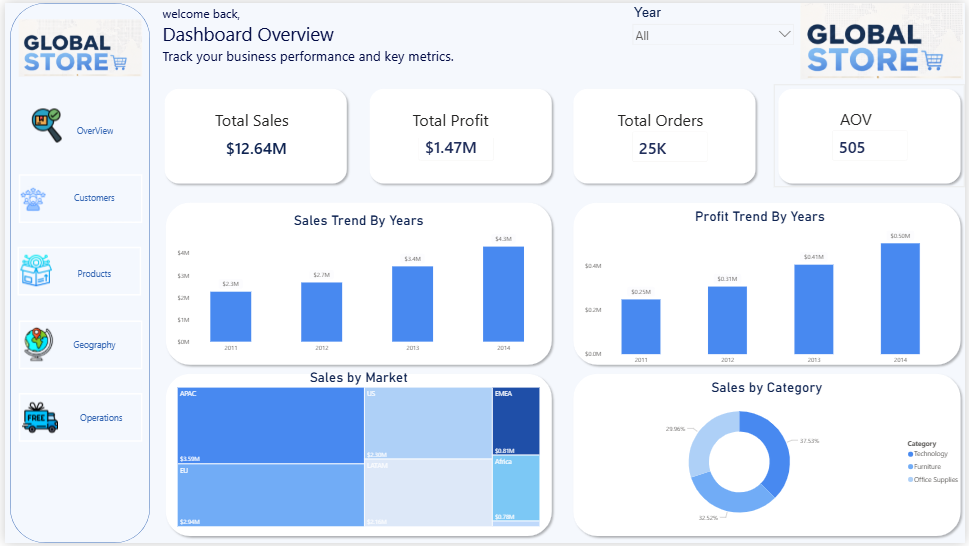
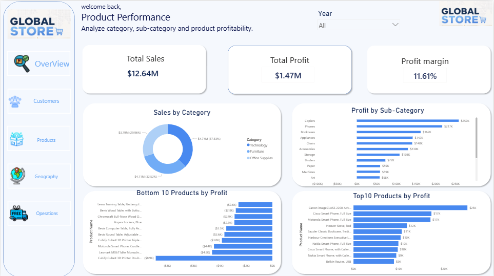
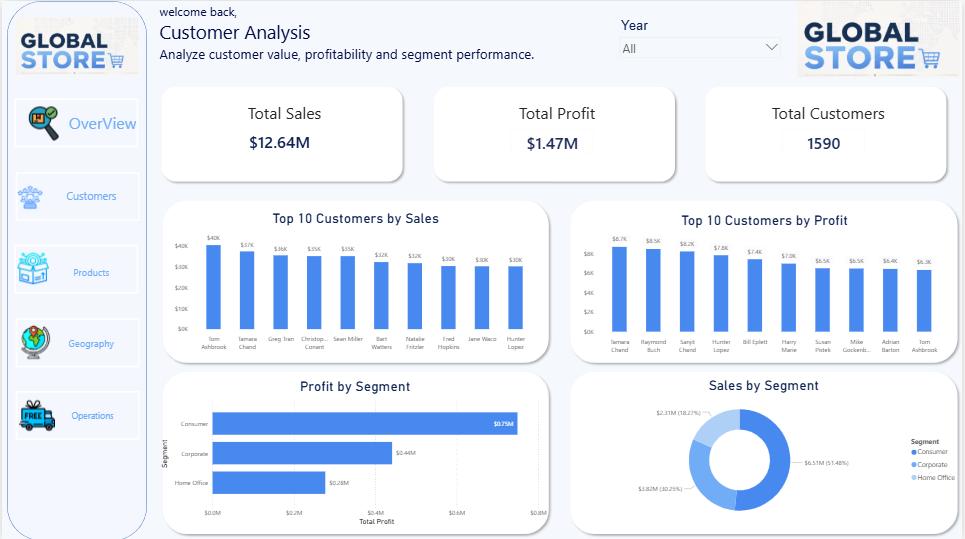
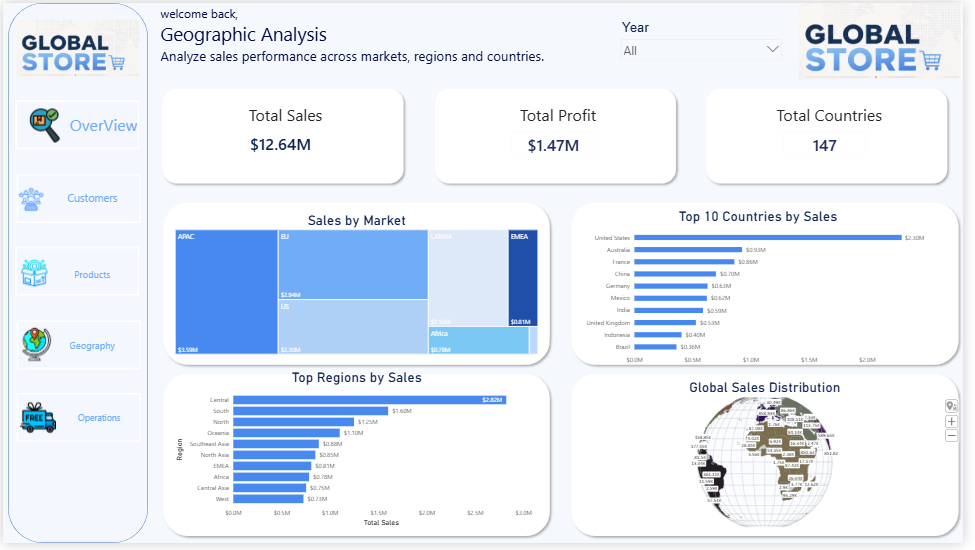
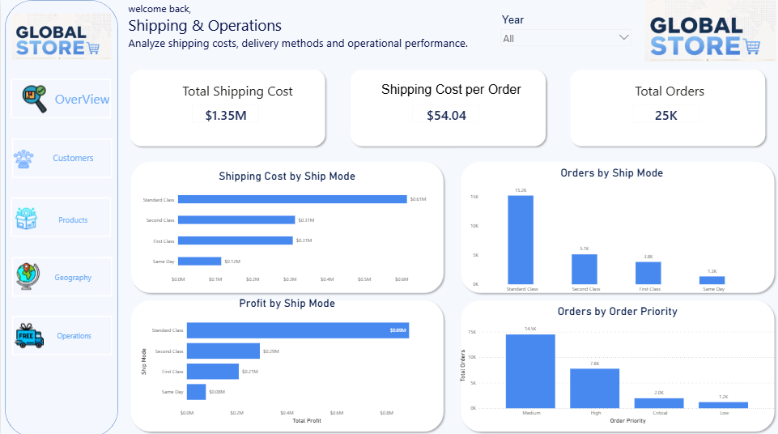
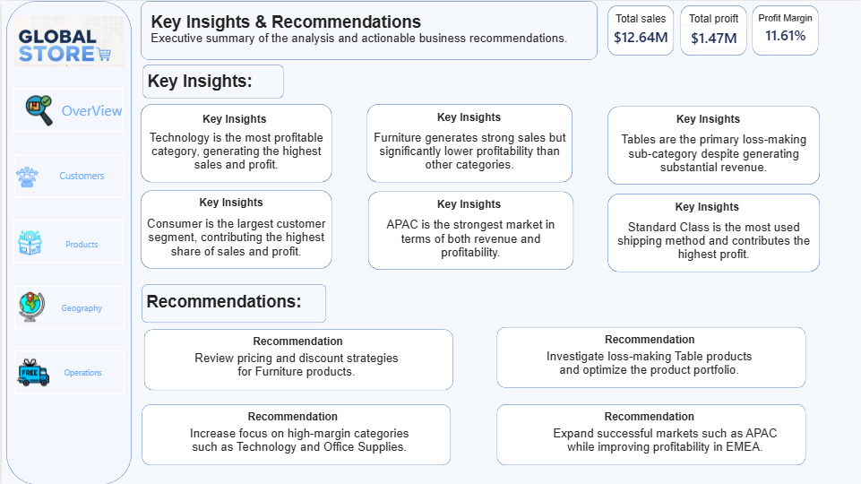

# Global Superstore Analytics Dashboard

## Dashboard Preview

### Home


### Executive Overview



### Product Performance



### Customer Analysis



### Geographic Analysis



### Shipping & Operations



### Insights & Recommendations



---
Power BI Dashboard File

The Power BI dashboard file can be downloaded from the link below:

📊 Download PBIX File

https://drive.google.com/file/d/1HRBLsDWdtXdIxBHfxaHQGoVtH0ng1CiL/view?usp=sharing

# Project Overview

This project presents a comprehensive business performance analysis of the Global Superstore dataset using SQL Server and Power BI.

The objective was to transform raw transactional data into actionable business insights by analyzing sales performance, profitability, customer behavior, product performance, geographic trends, and shipping operations.

The project follows a complete Data Analytics workflow:

1. Data Exploration using SQL Server
2. Business Analysis using SQL Queries
3. Data Modeling in Power BI
4. KPI Development using DAX
5. Dashboard Design and Visualization
6. Business Insights and Recommendations

---

# Business Objectives

The project aims to answer the following business questions:

* Which products generate the highest profit?
* Which products are causing losses?
* Which customer segments drive the most revenue?
* Which markets and countries perform best?
* How do shipping methods impact profitability?
* What operational improvements can increase business performance?

---

# Tools & Technologies

* SQL Server
* Power BI
* DAX
* Excel / CSV
* Data Modeling
* Business Intelligence

---

# Dataset Information

**Dataset:** Global Superstore

### Analysis Period

* Start Date: 2011-01-01
* End Date: 2014-12-31

### Dataset Size

* 51,290 Records
* 25,035 Orders
* 1,590 Customers
* 10,292 Products

### Key Attributes

* Orders
* Customers
* Products
* Categories
* Sales
* Profit
* Shipping Cost
* Markets
* Regions
* Countries
* Order Priority

---

# SQL Analysis

Before developing the dashboard, SQL Server was used to perform exploratory and business analysis.

### Data Exploration

* Dataset Overview
* Total Orders
* Total Customers
* Total Products
* Data Validation

### Executive Analysis

* Total Sales
* Total Profit
* Profit Margin
* Average Order Value
* Sales Trend by Year
* Profit Trend by Year

### Product Analysis

* Category Performance
* Sub-Category Performance
* Top Products by Profit
* Bottom Products by Profit

### Customer Analysis

* Customer Segmentation
* Top Customers by Sales
* Top Customers by Profit

### Geographic Analysis

* Market Performance
* Region Performance
* Top Countries by Sales

### Shipping Analysis

* Shipping Cost Analysis
* Ship Mode Performance
* Order Priority Analysis

---

# Power BI Dashboard Pages

## 1. Home

Navigation page designed to provide quick access to all dashboard sections.

## 2. Executive Overview

Provides a high-level summary of business performance.

### KPIs

* Total Sales
* Total Profit
* Profit Margin
* Total Orders
* Total Customers
* Average Order Value (AOV)

### Visuals

* Sales Trend
* Profit Trend
* Sales by Market
* Sales by Category

## 3. Product Performance

Analyzes product profitability and category performance.

### Visuals

* Sales by Category
* Profit by Sub-Category
* Top 10 Products by Profit
* Bottom 10 Products by Profit

## 4. Customer Analysis

Analyzes customer value and segment performance.

### Visuals

* Top Customers by Sales
* Top Customers by Profit
* Sales by Segment
* Profit by Segment

## 5. Geographic Analysis

Analyzes sales performance across markets and countries.

### Visuals

* Sales by Market
* Top Countries by Sales
* Regional Performance
* Global Sales Distribution

## 6. Shipping & Operations

Analyzes operational efficiency and shipping performance.

### KPIs

* Total Shipping Cost
* Shipping Cost per Order
* Total Orders

### Visuals

* Shipping Cost by Ship Mode
* Orders by Ship Mode
* Profit by Ship Mode
* Orders by Priority

## 7. Insights & Recommendations

Executive summary page containing the most important business findings and recommended actions.

---

# Key Insights

### Product Performance

* Technology is the most profitable category.
* Furniture generates high sales but lower profitability.
* Tables are the primary loss-making sub-category.
* Copiers and Phones are among the highest-performing product groups.

### Customer Analysis

* Consumer is the largest customer segment.
* A small group of customers contributes a significant portion of total sales and profit.

### Geographic Analysis

* APAC is the strongest market in terms of both sales and profit.
* EMEA generates relatively lower profit margins compared to other markets.

### Operations Analysis

* Standard Class is the most frequently used shipping method.
* Standard Class contributes the highest total profit.

---

# Recommendations

### Product Strategy

* Review pricing and discount strategies for Furniture products.
* Investigate loss-making Table products and optimize the product portfolio.
* Increase focus on high-margin categories such as Technology and Office Supplies.

### Market Strategy

* Expand investment in high-performing markets such as APAC.
* Improve profitability strategies in lower-margin markets.

### Customer Strategy

* Develop retention and loyalty programs for high-value customers.
* Create targeted campaigns for profitable customer segments.

### Operations Strategy

* Optimize shipping costs while maintaining customer satisfaction.
* Continue leveraging Standard Class as the primary fulfillment method.

---

# Folder Structure

```text
global-superstore-dashboard/

├── data/
│   └── Global_Superstore.csv

├── sql/
│   ├── 01_data_exploration.sql
│   ├── 02_executive_overview.sql
│   ├── 03_product_analysis.sql
│   ├── 04_customer_analysis.sql
│   ├── 05_geographic_analysis.sql
│   └── 06_shipping_analysis.sql

├── screenshots/
│   ├── home.png
│   ├── executive-overview.png
│   ├── product-performance.png
│   ├── customer-analysis.png
│   ├── geographic-analysis.png
│   ├── shipping-operations.png
│   └── insights.png

└── README.md
```

---

# Project Outcome

This project demonstrates an end-to-end Business Intelligence workflow using SQL Server and Power BI.

The final dashboard provides decision-makers with actionable insights across:

* Sales Performance
* Product Profitability
* Customer Behavior
* Geographic Trends
* Shipping Operations

and supports data-driven business decisions through interactive visual analytics.
